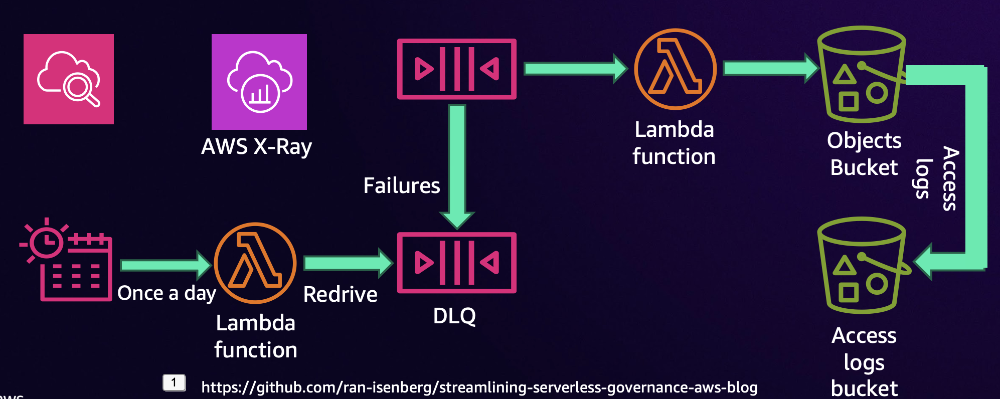

# Secure SQS to Lambda to S3 Blueprint (Python)

[](https://github.com/ran-isenberg/streamlining-serverless-governance-aws-blog/blob/master/LICENSE)


This project provides a working, open source based, AWS Lambda handler skeleton Python code including DEPLOYMENT code with CDK and a pipeline.

This project can serve as a template for new Serverless services - CDK deployment code, pipeline and handler are covered.

**[Blogs website](https://www.ranthebuilder.cloud)**
> **Contact details | ran.isenberg@ranthebuilder.cloud**

[](https://twitter.com/IsenbergRan)
[](https://www.ranthebuilder.cloud/)

## Getting Started


This repository contains an AWS CDK project that sets up a secure and cost-optimized architecture consisting of an SQS queue, a Lambda function, and an S3 bucket, along with a Dead Letter Queue (DLQ) and redrive policies.

The architecture adheres to security best practices and governance for optimized cost.

## Architecture Overview

<p align="center">
  
</p>


1. **SQS Queue**:
   - Receives messages and triggers the Lambda function.
   - Configured with a Dead Letter Queue (DLQ) for message failures.
   - Follows security best practices such as encryption at rest and transit

2. **Lambda Function**:
   - Processes messages from the SQS queue.
   - Writes processed data to an S3 bucket.
   - Configured with an IAM role that limits permissions to only necessary actions (principle of least privilege).

3. **S3 Bucket**:
   - Stores processed data from the Lambda function.
   - Configured with server-side encryption, versioning, and access controls.
   - Logging and monitoring enabled for governance and compliance.

4. **Dead Letter Queue (DLQ)**:
   - Captures failed messages from the SQS queue for further inspection and redrive once per day with an EventBridge rule and a Lambda function.

## Security Best Practices Implemented

- **Encryption**: All data at rest and in transit is encrypted using AWS-managed or customer-managed keys.
- **IAM Roles and Policies**: IAM roles follow the principle of least privilege, granting only the necessary permissions for each component.
- **Network Security**: Components are configured to restrict public access and enforce secure communication.
- **Cost Optimization**: Lifecycle policies on S3 buckets and efficient use of SQS and Lambda to minimize costs.

## Prerequisites

- AWS CLI configured with appropriate permissions.
- AWS CDK installed (`npm install -g aws-cdk`).
- Python 3.12 installed with poetry installed.

## Installation and Deployment

1. **Clone the repository**:
   ```bash
   git clone https://github.com/ran-isenberg/streamlining-serverless-governance-aws-blog.git
   cd streamlining-serverless-governance-aws-blog
   make dev
   make deploy

**That's it, your developer environment has been set and deployed:**


## Connect
* Email: [ran.isenberg@ranthebuilder.cloud](mailto:ran.isenberg@ranthebuilder.cloud)
* Blog Website [RanTheBuilder](https://www.ranthebuilder.cloud)
* LinkedIn: [ranisenberg](https://www.linkedin.com/in/ranisenberg/)
* Twitter: [IsenbergRan](https://twitter.com/IsenbergRan)

## Credits
* [AWS Lambda Powertools (Python)](https://github.com/aws-powertools/powertools-lambda-python)

## License
This library is licensed under the MIT License. See the [LICENSE](https://github.com/ran-isenberg/streamlining-serverless-governance-aws-blog/blob/main/LICENSE) file.
